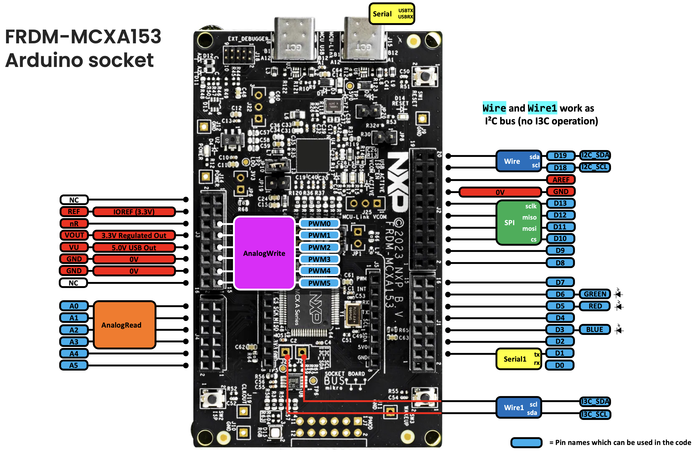

# Pin Mapping — FRDM-MCXA153

Arduino pin names are defined in
[`hardware/nxp/mcx/variants/frdm_mcxa153/include/io.h`](hardware/nxp/mcx/variants/frdm_mcxa153/include/io.h),
which maps each one (`D0`-`D13`, `D18`/`D19`, `A0`-`A5`, `PWM0`-`PWM5`) to its
physical MCU port pin.

| Arduino pin | MCU pin | Notes |
|---|---|---|
| `D0` | `P1_4` | `Serial1` RX |
| `D1` | `P1_5` | `Serial1` TX |
| `D2` | `P2_4` | |
| `D3` | `P3_0` | on-board Blue LED (`BLUE`) |
| `D4` | `P2_5` | |
| `D5` | `P3_12` | on-board Red LED (`RED`) |
| `D6` | `P3_13` | on-board Green LED (`GREEN`) |
| `D7` | `P3_1` | |
| `D8` | `P3_15` | |
| `D9` | `P3_14` | |
| `D10` | `P2_6` | `SPI` CS |
| `D11` | `P2_13` | `SPI` MOSI |
| `D12` | `P2_16` | `SPI` MISO |
| `D13` | `P2_12` | `SPI` SCLK |
| `D18` | `P1_8` | `Wire` (I2C) SDA |
| `D19` | `P1_9` | `Wire` (I2C) SCL |
| `A0`-`A3` | `P1_10`, `P1_12`, `P1_13`, `P2_0` | `analogRead` (LPADC), 10bit |
| `A4`, `A5` | `P3_31`, `P3_30` | digital I/O only, not ADC-capable |
| `PWM0`-`PWM5` | `P3_11`...`P3_6` | `analogWrite` (FlexPWM0), see [`test_PWM_pin_identify`](examples/Arduino_compatible_API/test_PWM_pin_identify) |

Other named pins/peripherals:

| Name | MCU pin(s) | Used by |
|---|---|---|
| `USBTX` / `USBRX` | `P0_3` / `P0_2` | `Serial` (USB-bridged UART) |
| `I3C_SDA` / `I3C_SCL` | `P0_16` / `P0_17` | `Wire1` (I3C, I2C mode) — on-board P3T1755 temperature sensor |
| `SW2` / `SW3` | `P3_29` / `P1_7` | on-board push buttons |

> **Note on `Wire1`**: `I3C_SDA`/`I3C_SCL` are wired to the MCU's I3C peripheral, not a
> second I2C controller. `Wire1` drives that peripheral in I2C-compatibility mode, so it
> exposes the same `TwoWire` API as `Wire` and talks to plain I2C devices (such as the
> on-board P3T1755) — no I3C-specific features (dynamic addressing, IBI, higher clock
> rates, etc.) are used or exposed.

MikroBus header pins — plain `digitalWrite`/`digitalRead` GPIO on all of
these, verified on real hardware:

| Name | MCU pin | Notes |
|---|---|---|
| `MB_AN` | `P3_30` | same pin as `A5` |
| `MB_RST` | `P3_1` | same pin as `D7` |
| `MB_CS` | `P1_3` | `SPI1` (MikroBus SPI) CS |
| `MB_SCK` | `P1_1` | `SPI1` SCK |
| `MB_MISO` | `P1_2` | `SPI1` MISO |
| `MB_MOSI` | `P1_0` | `SPI1` MOSI |
| `MB_PWM` | `P3_12` | same pin as `D5`/`RED` |
| `MB_INT` | `P2_5` | same pin as `D4` |
| `MB_RX` | `P3_14` | same pin as `D9` |
| `MB_TX` | `P3_15` | same pin as `D8` |
| `MB_SCL` | `P3_27` | same physical I2C peripheral as `Wire` — see note below |
| `MB_SDA` | `P3_28` | same physical I2C peripheral as `Wire` — see note below |

> **`SPI1`** is a plain SPI instance on `MB_MOSI`/`MB_MISO`/`MB_SCK`/`MB_CS`,
> backed by its own peripheral (`LPSPI0`, vs. `SPI`'s `LPSPI1` — this chip
> only has these two LPSPI instances total), so both can be used in the same
> sketch. Verified on real hardware with `test_SPI1_MikroBus_A153`
> (MOSI-MISO loopback, logic analyzer + Serial both confirmed OK).
>
> **No independent `Wire2`/second `Serial1` on this board.** Unlike
> FRDM-MCXN947, this chip has only one physical I2C peripheral (`LPI2C0`)
> and its existing `Serial1` (`D0`/`D1`) already uses the same `LPUART2`
> that `MB_TX`/`MB_RX` would need — so I2C/UART on the MikroBus pins can
> only ever be alternate pin routings for `Wire`/`Serial1`, mutually
> exclusive with using them on their usual pins, not genuinely independent
> instances.

See [PIN_MAPPING_N947.md](PIN_MAPPING_N947.md) for FRDM-MCXN947's pin mapping.
