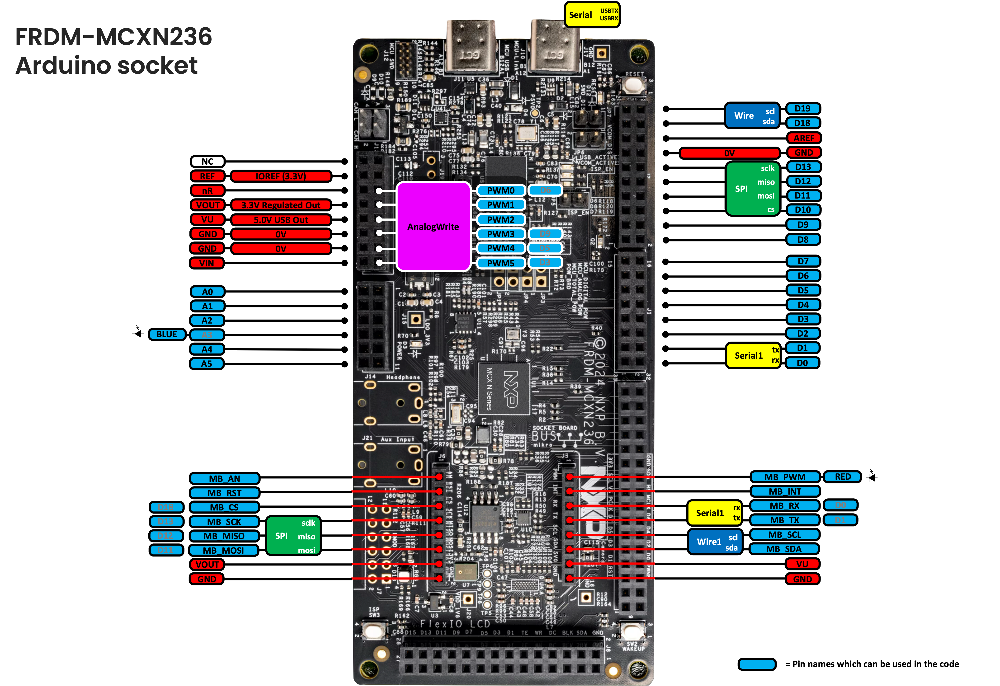

# Pin Mapping — FRDM-MCXN236

Arduino pin names are defined in
[`hardware/nxp/mcx/cores/arduino/r01lib/io.h`](hardware/nxp/mcx/cores/arduino/r01lib/io.h),
which maps each one (`D0`-`D13`, `D18`/`D19`, `A0`-`A5`, `PWM0`-`PWM5`) to its
physical MCU port pin. The board is Rev C; on earlier revisions `D18`/`D19`
are other pins.

## Board modification this core assumes

> [!IMPORTANT]
> **Remove R25 and R67 to use `A1`/`A2` as analog inputs.** As shipped, `A1`
> (`P4_15`) and `A2` (`P4_16`) are also wired through these 0Ω resistors to
> the on-board CAN transceiver (TJA1057). The transceiver is always powered
> and in normal mode, so its receive output drives `A1` high whenever no CAN
> bus is attached, and `A2` sees the pull-up on its transmit input. This
> core assumes both are removed. With them removed, the board's CAN
> interface (FlexCAN) cannot be used.
>
> | Resistor | Header pin | As shipped | Assumed by this core |
> |---|---|---|---|
> | R25 | `A1` | Short (to `CAN_RXD`) | Open |
> | R67 | `A2` | Short (to `CAN_TXD`) | Open |

> [!NOTE]
> **`A3` is the blue LED's pin too, and `analogRead(A3)` returns `-1`.**
> `A3` (`P4_17`) is wired to the on-board blue LED with no way to cut it off,
> so the core keeps it a digital pin. `analogRead(A3)` returns `-1`, which
> no reading takes at any resolution, instead of stopping the sketch.

SJ1 and SJ2 are left at their factory 1-2 position, which puts `SPI` on
`D10`/`D11`. At 2-3 they would connect `D10`/`D11` to the PWM pins `P3_15`/
`P3_16` instead.

  
*FRDM-MCXN236 Arduino shield and MikroBus socket pins*

## Arduino header

| Arduino pin | MCU pin | Notes |
|---|---|---|
| `D0` | `P4_3` | `Serial1` RX; also `MB_RX` |
| `D1` | `P4_2` | `Serial1` TX; also `MB_TX` |
| `D2` | `P2_0` | |
| `D3` | `P3_12` | `analogWrite` (`PWM5`) |
| `D4` | `P0_21` | |
| `D5` | `P2_7` | `analogWrite` (`PWM4`) |
| `D6` | `P3_17` | `analogWrite` (`PWM0`) |
| `D7` | `P0_22` | |
| `D8` | `P0_23` | |
| `D9` | `P3_14` | `analogWrite` (`PWM3`) |
| `D10` | `P1_3` | `SPI` CS |
| `D11` | `P1_0` | `SPI` MOSI; also `MB_MOSI` |
| `D12` | `P1_2` | `SPI` MISO; also `MB_MISO` |
| `D13` | `P1_1` | `SPI` SCLK; also `MB_SCK` |
| `D18` | `P1_16` | `Wire` (I2C) SDA; also `MB_CS` |
| `D19` | `P1_17` | `Wire` (I2C) SCL |
| `A0` | `P4_6` | `analogRead` (LPADC/ADC0), 10bit |
| `A1`, `A2` | `P4_15`, `P4_16` | `analogRead` (LPADC/ADC0), 10bit — **remove R25/R67 first** (see above) |
| `A3` | `P4_17` | digital only, on-board blue LED (`BLUE`); `analogRead` returns `-1` |
| `A4`, `A5` | `P4_12`, `P4_13` | `analogRead` (LPADC/ADC0), 10bit |

`NUM_ANALOG_INPUTS` is 5.

`analogWrite` pins (FlexPWM1, on the motor-control header `J3`). Four of
them are also D-pins, so `analogWrite` works on `D3`, `D5`, `D6` and `D9`
too:

| Arduino pin | MCU pin | Submodule | Channel | Also |
|---|---|---|---|---|
| `PWM0` | `P3_17` | sm2 | B | `D6` |
| `PWM1` | `P3_16` | sm2 | A | |
| `PWM2` | `P3_15` | sm1 | B | |
| `PWM3` | `P3_14` | sm1 | A | `D9` |
| `PWM4` | `P2_7` | sm0 | B | `D5` |
| `PWM5` | `P3_12` | sm0 | A | `D3` |

> **PWM frequency**: `analogWriteFrequency(pin, hz)` sets a pin's PWM
> frequency (non-standard extension, not part of the official Arduino API —
> modeled on Teensy's function of the same name). `PWM0`/`PWM1`,
> `PWM2`/`PWM3`, and `PWM4`/`PWM5` each pair up on one FlexPWM1 submodule and
> share its period register, so changing one pin's frequency changes its
> paired pin's frequency too.
>
> The paired pin keeps its pulse width in microseconds, cut short if it no
> longer fits the new period; `analogWrite()` on either pin then sets its
> duty at the shared frequency. A pin's first `analogWrite()` joins its pair
> at the frequency the pair is already running at. (Before 0.9.0,
> `analogWrite()` on the paired pin put its own earlier frequency back and
> left the other pin's duty wrong.)

## Other named pins and peripherals

| Name | MCU pin(s) | Used by |
|---|---|---|
| `USBTX` / `USBRX` | `P1_9` / `P1_8` | `Serial` (USB-bridged UART) |
| `RED` / `GREEN` / `BLUE` | `P4_18` / `P4_19` / `P4_17` | on-board RGB LED (on when LOW). `RED` is also `MB_PWM`, `BLUE` is also `A3` |
| `SW2` / `SW3` | `P0_20` / `P0_6` | on-board push buttons |

> **There is no temperature sensor on this board, and no I3C.** The on-board
> sensor is an FXLS8974CF accelerometer at `0x18`, on `Wire1` (see below).
> The MCU's I3C peripheral reaches only `D18`/`D19`, which `Wire` uses, so
> the core does not use it. Its interrupt outputs are not connected to the
> MCU.

## MikroBus header

Plain `digitalWrite`/`digitalRead` GPIO on all of these:

| Name | MCU pin | Notes |
|---|---|---|
| `MB_AN` | `P5_3` | |
| `MB_RST` | `P5_2` | |
| `MB_CS` | `P1_16` | the same pin as `D18` (`Wire` SDA) |
| `MB_SCK` | `P1_1` | the same pin as `D13` |
| `MB_MISO` | `P1_2` | the same pin as `D12` |
| `MB_MOSI` | `P1_0` | the same pin as `D11` |
| `MB_PWM` | `P4_18` | the same pin as `RED` |
| `MB_INT` | `P5_6` | |
| `MB_RX` | `P4_3` | the same pin as `D0` (`Serial1` RX) |
| `MB_TX` | `P4_2` | the same pin as `D1` (`Serial1` TX) |
| `MB_SCL` | `P4_1` | `Wire1` (I2C) SCL |
| `MB_SDA` | `P4_0` | `Wire1` SDA |

> **`Wire1`** is a plain I2C instance on `MB_SDA`/`MB_SCL`, backed by its own
> peripheral (`LPI2C2`, vs. `Wire`'s `LPI2C5`), so both can be used in the
> same sketch. The on-board accelerometer is on this bus, along with other
> on-board parts, and the board has 4.7kΩ pull-ups on it. `LPI2C2` shares
> its FlexComm with `Serial1`'s `LPUART2`, and the core runs the two at once.
>
> The MikroBus UART is `D0`/`D1` and its SPI is `SPI`'s own lines with CS on
> `D18`, so this board has no `Serial2` and no `SPI1`.

See [PIN_MAPPING_A153.md](PIN_MAPPING_A153.md),
[PIN_MAPPING_N947.md](PIN_MAPPING_N947.md) and
[PIN_MAPPING_A156.md](PIN_MAPPING_A156.md) for the other boards.
