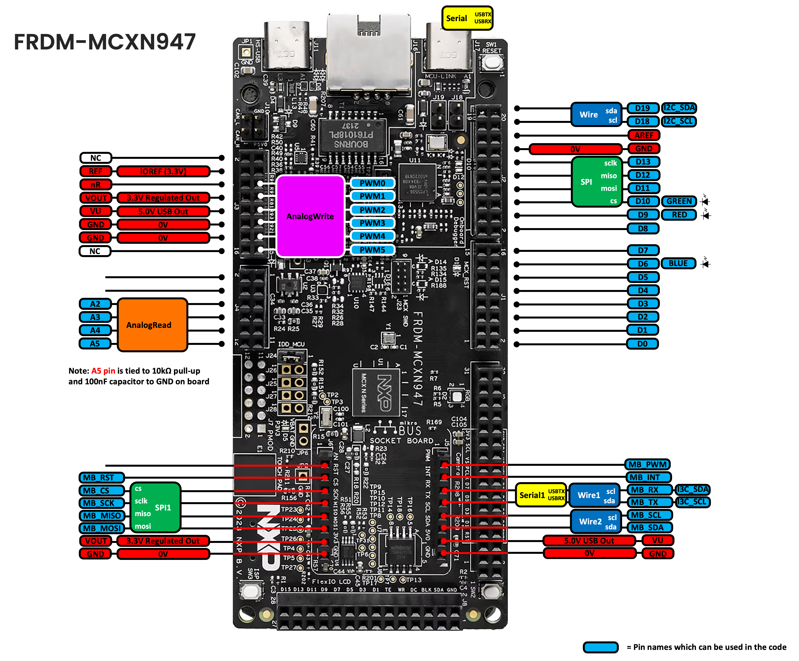

# Pin Mapping — FRDM-MCXN947

Arduino pin names are defined in
[`hardware/nxp/mcx/variants/frdm_mcxn947/include/io.h`](hardware/nxp/mcx/variants/frdm_mcxn947/include/io.h),
which maps each one (`D0`-`D13`, `D18`/`D19`, `A0`-`A5`, `PWM_0`-`PWM_5`) to its
physical MCU port pin. See that board's own
[`variants/frdm_mcxn947/README.md`](hardware/nxp/mcx/variants/frdm_mcxn947/README.md)
for the full verification status and per-feature notes this table summarizes.

  
*FRDM-MCXN947 Arduino shield and MicroBus socket pins*

| Arduino pin | MCU pin | Notes |
|---|---|---|
| `D0` | `P4_3` | not `Serial1` (see the `Serial1` note below — it's on the MikroBus header instead) |
| `D1` | `P4_2` | not `Serial1` (see the `Serial1` note below — it's on the MikroBus header instead) |
| `D2` | `P0_29` | |
| `D3` | `P1_23` | |
| `D4` | `P0_30` | |
| `D5` | `P1_21` | |
| `D6` | `P1_2` | on-board Blue LED (`BLUE`) |
| `D7` | `P0_31` | |
| `D8` | `P0_28` | |
| `D9` | `P0_10` | on-board Red LED (`RED`) |
| `D10` | `P0_27` | on-board Green LED (`GREEN`); also `SPI` CS |
| `D11` | `P0_24` | `SPI` MOSI |
| `D12` | `P0_26` | `SPI` MISO |
| `D13` | `P0_25` | `SPI` SCLK |
| `D18` | `P4_0` | `Wire` (I2C) SDA |
| `D19` | `P4_1` | `Wire` (I2C) SCL |
| `A0`, `A1` | — | **not available** — not wired to an ADC channel on this board |
| `A2`-`A5` | `P0_14`, `P0_22`, `P0_15`, `P0_23` | `analogRead` (LPADC/ADC0), 10bit |

`analogWrite` pins (FlexPWM1, not FlexPWM0 — see note below):

| Arduino pin | MCU pin | Submodule | Channel |
|---|---|---|---|
| `PWM_0` | `P2_3` | sm2 | B |
| `PWM_1` | `P2_2` | sm2 | A |
| `PWM_2` | `P2_5` | sm1 | B |
| `PWM_3` | `P2_4` | sm1 | A |
| `PWM_4` | `P2_7` | sm0 | B |
| `PWM_5` | `P2_6` | sm0 | A |

> **Note on `PWM_0`-`PWM_5`**: these are on the "Arduino Shield Compatible
> Headers" sheet's dedicated PWM row (`P2_2`-`P2_7`, shared with header `J12`/
> `J3`), not the `D0`-`D19` pins, and not physically sequential — the
> assignment above matches the "PWM0"-"PWM5" silkscreen labels printed
> directly on that header in the schematic. Named `PWM_0`-`PWM_5`
> (underscore), not `PWM0`-`PWM5` — this chip's SDK already uses the bare
> `PWM0`/`PWM1` identifiers for the FlexPWM peripheral instances themselves.

Other named pins/peripherals:

| Name | MCU pin(s) | Used by |
|---|---|---|
| `USBTX` / `USBRX` | `P1_9` / `P1_8` | `Serial` (USB-bridged UART) |
| `I3C_SDA` / `I3C_SCL` (`MB_RX` / `MB_TX`) | `P1_16` / `P1_17` | `Wire1` (I3C, I2C mode) — on-board P3T1755 temperature sensor |
| `SW2` / `SW3` | `A5` (`P0_23`) / `P0_6` | on-board push buttons — note `SW2` shares its pin with `A5` |

MikroBus header pins (connector `J5`/`J6`) — plain `digitalWrite`/`digitalRead`
GPIO on all of these (verified on real hardware), plus dedicated I2C/SPI
peripheral instances on the SPI/I2C rows (see below the table):

| Name | MCU pin | Notes |
|---|---|---|
| `MB_AN` | — | **not available** — `DISABLED_PIN` on this board |
| `MB_RST` | `P1_3` | |
| `MB_CS` | `P3_23` | `SPI1` (MikroBus SPI) CS |
| `MB_SCK` | `P3_21` | `SPI1` SCK |
| `MB_MISO` | `P3_22` | `SPI1` MISO |
| `MB_MOSI` | `P3_20` | `SPI1` MOSI |
| `MB_PWM` | `P3_19` | |
| `MB_INT` | `P5_7` | |
| `MB_RX` | `P1_16` | `Wire1` (same pin as I3C_SDA); also `Serial1` RX — see below |
| `MB_TX` | `P1_17` | `Wire1` (same pin as I3C_SCL); also `Serial1` TX — see below |
| `MB_SCL` | `P1_1` | `Wire2` (MikroBus I2C) SCL |
| `MB_SDA` | `P1_0` | `Wire2` SDA |

> **`Wire2`** is a plain I2C instance on `MB_SDA`/`MB_SCL`, backed by its own
> peripheral (`LPI2C3`/FlexComm3) independent of `Wire` (FlexComm2) and
> `Wire1` (I3C) — all three can be used in the same sketch. Verified on real
> hardware with `test_Wire2_MikroBus_N947` (bus scan).
>
> **`SPI1`** is a plain SPI instance on `MB_MOSI`/`MB_MISO`/`MB_SCK`/`MB_CS`,
> backed by its own peripheral (`LPSPI6`/FlexComm6) independent of `SPI`
> (FlexComm1). Verified on real hardware with `test_SPI1_MikroBus_N947`
> (MOSI-MISO loopback, logic analyzer + Serial both confirmed OK).

> **Note on `Wire1`/`Serial1`**: `MB_RX`/`MB_TX` (`P1_16`/`P1_17`) are shared
> by three functions — `Wire1` (I3C-in-I2C-mode, same design as A153's
> `Wire1` but on different physical pins — see
> [PIN_MAPPING_A153.md](PIN_MAPPING_A153.md)'s note), plain GPIO, and
> `Serial1` (hardware UART, `LPUART5`/FlexComm5 — a FlexComm instance
> nothing else on this board claims, unlike the D0/D1 case below). Only one
> function is active at a time on the two physical pins, but all three
> switch cleanly between each other: `pinMode()` explicitly reclaims ALT0
> (GPIO) on every call, and `Wire1.begin()`/`Serial1.begin()` each
> explicitly set their own ALT — confirmed on real hardware by running
> `onboard_temperature_sensor` (I3C) → `test_digitalWrite_mikrobus_pins_N947`
> (GPIO) → `test_Serial1_MikroBus_N947` (UART loopback) back to back.

> **`Serial1` is NOT available on `D0`/`D1`.** Their only UART-capable
> peripheral (FlexComm2) is the same instance `Wire` already uses for I2C — a
> FlexComm can only be one peripheral mode at a time, so the two can't
> coexist in one sketch. Referencing `Serial1` uses the MikroBus header
> instead (see above), not D0/D1.

See [PIN_MAPPING_A153.md](PIN_MAPPING_A153.md) for FRDM-MCXA153's pin mapping.
