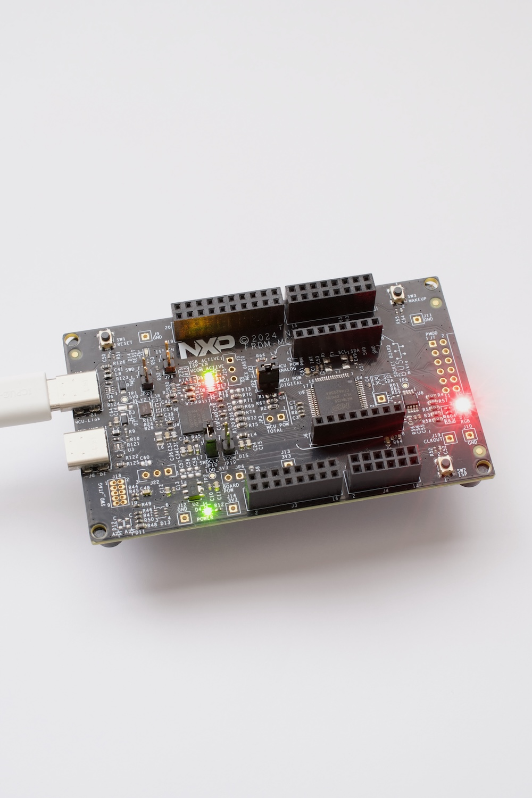
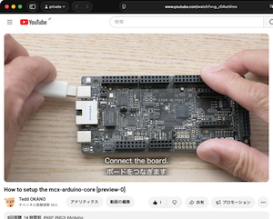

# mcx-arduino-core

    
*FRDM-MCXA153*


Arduino board support package for NXP FRDM MCX Series boards.

New here? Start with the [tutorial](TUTORIAL.md) ([日本語版](TUTORIAL.ja.md)).
See [API_COMPATIBILITY.md](API_COMPATIBILITY.md) for the full Arduino API support status,
[PIN_MAPPING_A153.md](PIN_MAPPING_A153.md) / [PIN_MAPPING_N947.md](PIN_MAPPING_N947.md)
for each board's pin assignments, and [CHANGELOG.md](CHANGELOG.md) for release history.

[ Setup guide video](https://youtu.be/g_rDAxnVnro) is available. 

## Supported Boards

| Board | MCU | Core |
|-------|-----|------|
| FRDM-MCXA153 | MCXA153 (Cortex-M33) | ✅ |
| FRDM-MCXA156 | MCXA156 (Cortex-M33) | 🔜 |
| FRDM-MCXN947 | MCXN947 (Cortex-M33) | ✅ |
| FRDM-MCXN236 | MCXN236 (Cortex-M33) | 🔜 |

> **Note**: mcx-arduino-core is an independent, community project and is not
> part of or affiliated with Arduino's official
> [ArduinoCore-zephyr](https://github.com/arduino/ArduinoCore-zephyr). See
> [Relationship to ArduinoCore-zephyr](#relationship-to-arduinocore-zephyr)
> at the end of this document for why this project exists alongside it.

## Requirements

### NXP LinkServer (Required for uploading)

This package uses **NXP LinkServer** for uploading sketches to the board.  
Please install it before using the Upload button in Arduino IDE.

👉 Download: https://www.nxp.com/linkserver

| OS | Installer |
|----|-----------|
| macOS | `.pkg` file, double-click to install |
| Windows | `.exe` installer |
| Linux | `.deb.bin` file |

After installation, the upload script will automatically detect LinkServer — no path configuration needed.

The install → build → upload flow has been verified on **macOS, Windows 11, and Linux**.

## Installation

1. Open [Arduino IDE](https://docs.arduino.cc/software/ide/) 2.x
2. Go to **File → Preferences**
3. Add the following URL to **Additional boards manager URLs**:
```
https://raw.githubusercontent.com/teddokano/mcx-arduino-core/main/package_nxp_mcx_index.json
```

4. Go to **Tools → Board → Boards Manager**
5. Search for `NXP MCX` and click **Install**

## Architecture

This package uses a prebuilt library approach:
```
mcx-arduino-core/
├── hardware/nxp/mcx/
│   ├── platform.txt          # Compiler/linker settings
│   ├── boards.txt            # Board definitions
│   ├── cores/arduino/        # Arduino API headers
│   ├── tools/
│   │   └── upload.sh         # Upload script (auto-detects LinkServer)
│   └── variants/
│       └── frdm_mcxa153/
│           ├── include/      # Board-specific headers
│           ├── linker/       # Linker scripts
│           └── lib/          # Prebuilt .a library
└── package_nxp_mcx_index.json
```

The prebuilt library (`lib_r01lib_frdm_mcxa153.a`) contains:
- NXP MCX SDK drivers (fsl_gpio, fsl_lpuart, fsl_lpi2c, fsl_lpspi, ...)
- r01lib core (Serial, I2C, SPI, GPIO, InterruptIn, Ticker, ...)
- Arduino layer (digitalWrite, Wire, SPI, Serial.print, ...)
- Board files (pin_mux, clock_config, board, ...)

## Example Sketch
```cpp
#include "arduino.h"

void setup() {
    Serial.begin(115200);
    Serial.println("Hello from FRDM-MCXA153!");
    pin_mode(RED, OUTPUT);
}

void loop() {
    digitalWrite(RED, LOW);
    delay(500);
    digitalWrite(RED, HIGH);
    delay(500);
}
```

## Building the Prebuilt Library

The prebuilt `.a` library is built with MCUXpresso IDE from the `_r01lib_frdm_mcxa153` project in the [r01lib repository](https://github.com/teddokano/r01lib).

## License

MIT License — see [LICENSE](LICENSE)

## Pin Mapping

See [PIN_MAPPING_A153.md](PIN_MAPPING_A153.md) / [PIN_MAPPING_N947.md](PIN_MAPPING_N947.md)
for the full Arduino-pin-to-MCU-pin table for each supported board, including
the on-board LEDs/buttons and peripheral pins (`Wire1`, `SPI`, `PWM`, etc.).

## Supported Arduino APIs

GPIO, interrupts, Serial (USB + hardware UART), Wire (I2C and I3C-as-I2C),
SPI, analogRead/analogWrite, millis/micros, tone/noTone, delay family,
String, real `Print`/`Stream`/`Printable` base classes, F()/PROGMEM, and
UNO R3/R4 compatibility macros are all supported. I2C slave mode and
`Wire.setWireTimeout` are the two known gaps. Third-party libraries that
inherit `Print` directly or take `Stream&` (e.g. ArduinoJson, LiquidCrystal,
Adafruit sensor libraries) compile against this core.

See [API_COMPATIBILITY.md](API_COMPATIBILITY.md) for the full per-API status
table and notes/caveats.

## Relationship to ArduinoCore-zephyr

Arduino's own [ArduinoCore-zephyr](https://github.com/arduino/ArduinoCore-zephyr) project already brings official Arduino support to some NXP MCX boards, including FRDM-MCXN947 — but not FRDM-MCXA153, and not by oversight. This project (mcx-arduino-core) is independent and unaffiliated with Arduino; it exists to cover FRDM-MCXA153, which ArduinoCore-zephyr's architecture can't fit on.

ArduinoCore-zephyr flashes a Zephyr-based "loader" once, then loads each sketch on top of it at runtime as a Zephyr **LLEXT** (Loadable Extension), rather than building one self-contained binary. That architecture keeps a Zephyr kernel, an LLEXT runtime, and symbol tables resident in RAM, plus a buffer to hold the incoming sketch during upload — the loader's source defines that buffer as `SKETCH_RAM_BUFFER_LEN 131072` (128KB). FRDM-MCXA153 has only **24KB of total RAM**, so that single buffer alone is over 5x the chip's entire RAM. FRDM-MCXN947, with far more RAM to spare, fits this architecture comfortably.

mcx-arduino-core takes the opposite approach: each sketch is statically linked into one monolithic binary against a prebuilt r01lib library — no loader, no dynamic linking, nothing LLEXT-shaped resident in RAM. That's what lets it fit inside FRDM-MCXA153's actual 24KB RAM / 128KB flash budget (the same figures reported by this board's own build output).

(Zephyr RTOS itself runs fine on FRDM-MCXA153 — LinkServer is even its default flash runner in mainline Zephyr. It's specifically the LLEXT-based Arduino layer that doesn't fit, not Zephyr as a whole.)
