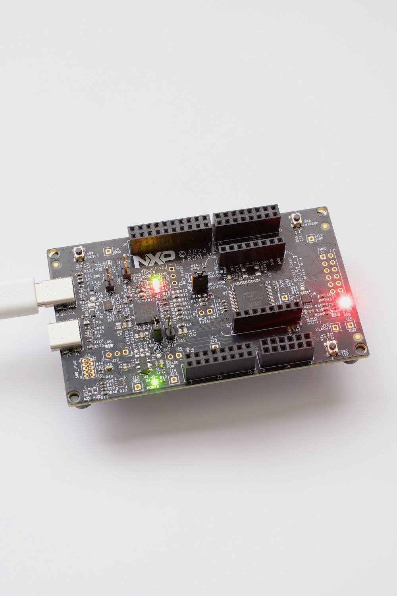
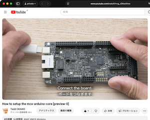

# mcx-arduino-core

<p align="center">
  <br>
  <em>FRDM-MCXA153</em>
</p>

Arduino board support package for NXP FRDM MCX Series boards.

日本語版はこちら → [README.ja.md](README.ja.md)

New here? Start with the [tutorial](TUTORIAL.md) ([日本語版](TUTORIAL.ja.md)).
See [API_COMPATIBILITY.md](API_COMPATIBILITY.md) for the full Arduino API support status,
[PIN_MAPPING_A153.md](PIN_MAPPING_A153.md) / [PIN_MAPPING_N947.md](PIN_MAPPING_N947.md) /
[PIN_MAPPING_A156.md](PIN_MAPPING_A156.md) / [PIN_MAPPING_N236.md](PIN_MAPPING_N236.md)
for each board's pin assignments, [CHANGELOG.md](CHANGELOG.md) for release history, and
[docs/api/](docs/api/index.html) for generated Doxygen class reference (the r01lib driver
core and the Arduino-compatible API layer).

Past the standard Arduino API, a few advanced guides go deeper:
[calling the MCUXpresso SDK directly](docs/advanced_sdk_tuning.md) for
GPIO speed, [native I3C via r01lib](docs/advanced_r01lib_i3c.md) for
functionality `Wire`-shaped APIs can't expose, and
[debugging pin ownership with mcxPinState](docs/mcxpinstate_guide.md), a
bundled companion library for exactly that. A second bundled library,
[mcxRCServo](https://github.com/teddokano/mcxRCServo), drives hobby RC
servos from the PWM pins (`PWM0`-`PWM5`, and `D3`/`D5`/`D6`/`D9` on
FRDM-MCXA156 and FRDM-MCXN236).

Adding another FRDM-MCX board to this core is a different job from using
it, and has its own guide:
[porting a new board](docs/porting_a_new_board.md).

[ Setup guide video](https://youtu.be/g_rDAxnVnro) is available. 

## Supported Boards

| Board | MCU | Core |
|-------|-----|------|
| FRDM-MCXA153 | MCXA153 (Cortex-M33) | ✅ |
| FRDM-MCXA156 | MCXA156 (Cortex-M33) | ✅ (from 0.8.0; see below) |
| FRDM-MCXN947 | MCXN947 (Cortex-M33) | ✅ |
| FRDM-MCXN236 | MCXN236 (Cortex-M33) | ✅ (from 0.9.0; see below) |

> **FRDM-MCXA156 needs two small board changes** for the Arduino header to
> work fully: move R59 and R60 to their 2-3 position, or `SPI`'s CS and
> MOSI never reach `D10`/`D11`; and remove R75 and R76, or the on-board
> CAN transceiver drives `A4`. See
> [PIN_MAPPING_A156.md](PIN_MAPPING_A156.md).

> **FRDM-MCXN236 needs R25 and R67 removed** for `A1`/`A2` to work as
> analog inputs, or the on-board CAN transceiver drives them. `A3` is the
> blue LED's pin, so `analogRead(A3)` returns `-1`. See
> [PIN_MAPPING_N236.md](PIN_MAPPING_N236.md).

> **Note**: mcx-arduino-core is an independent, community project and is not
> part of or affiliated with Arduino's official
> [ArduinoCore-zephyr](https://github.com/arduino/ArduinoCore-zephyr). See
> [Relationship to ArduinoCore-zephyr](#relationship-to-arduinocore-zephyr)
> at the end of this document for why this project exists alongside it.

## Requirements

### NXP LinkServer (Required for uploading and debugging)

This package uses **NXP LinkServer** for uploading sketches to the board,
and also as the backend for Arduino IDE 2's built-in debugger (breakpoints,
stepping, variable inspection) — LinkServer's own gdbserver is used under
the hood, since upstream OpenOCD has no support for the MCX chip family yet.
Please install it before using the Upload or Debug buttons in Arduino IDE.

👉 Download: https://www.nxp.com/linkserver

| OS | Installer |
|----|-----------|
| macOS | `.pkg` file, double-click to install |
| Windows | `.exe` installer |
| Linux | `.deb.bin` file |

After installation, the upload script will automatically detect LinkServer — no path configuration needed.

> **FRDM-MCXA153 and LinkServer 26.9:** LinkServer 26.9.130 reads the FRDM-MCXA153's flash as 32KB, so a sketch
> larger than that fails to upload ("Attempt to load into missing flash area"). Also install an earlier version
> (26.6 or before); having both installed is fine. Uploading and debugging then pass over 26.9 by themselves, for every board
> (FRDM-MCXN947, FRDM-MCXA156 and FRDM-MCXN236 work with 26.9, but all boards have to use the same LinkServer version, or the second one to upload fails).
>
> NXP's LinkServer page lists only the newest version. 26.6.137 can be downloaded directly:
>
> | OS | LinkServer 26.6.137 |
> |----|---------------------|
> | Windows | [LinkServer_26.6.137.exe](https://www.nxp.com/lgfiles/updates/mcuxpresso/LinkServer_26.6.137.exe) |
> | macOS (Apple silicon) | [LinkServer_26.6.137.aarch64.pkg](https://www.nxp.com/lgfiles/updates/mcuxpresso/LinkServer_26.6.137.aarch64.pkg) |
> | macOS (Intel) | [LinkServer_26.6.137.x86-64.pkg](https://www.nxp.com/lgfiles/updates/mcuxpresso/LinkServer_26.6.137.x86-64.pkg) |
> | Linux (x86_64) | [LinkServer_26.6.137.x86_64.deb.bin](https://www.nxp.com/lgfiles/updates/mcuxpresso/LinkServer_26.6.137.x86_64.deb.bin) |
> | Linux (arm64) | [LinkServer_26.6.137.aarch64.deb.bin](https://www.nxp.com/lgfiles/updates/mcuxpresso/LinkServer_26.6.137.aarch64.deb.bin) |
>
> As with the download page, downloading LinkServer means accepting NXP's software license agreement.

The install → build → upload flow has been verified on **macOS, Windows 11, and Linux**.

## Installation

1. Open [Arduino IDE](https://docs.arduino.cc/software/ide/) 2.x
2. Go to **File → Preferences**
3. Add the following URL to **Additional boards manager URLs**:
```
https://raw.githubusercontent.com/teddokano/mcx-arduino-core/main/package_nxp_mcx_index.json
```

4. Go to **Tools → Board → Boards Manager**
5. Search for `NXP MCX` and click **Install**

## Architecture

This package ships full source, built the same way as any other Arduino
core (AVR, SAMD, renesas_uno, ...) — no prebuilt library:
```
mcx-arduino-core/
├── hardware/nxp/mcx/
│   ├── platform.txt          # Compiler/linker/debugger settings
│   ├── boards.txt            # Board definitions
│   ├── cores/arduino/        # Shared source, built into core.a for every board, split by origin:
│   │   ├── arduino_api/      #   Arduino-compatible API layer (digitalWrite, Wire, SPI,
│   │   │                     #   Serial.print, String, Print/Stream, ...)
│   │   ├── r01lib/           #   r01lib hardware driver core (Serial, I2C/I3C, SPI, GPIO,
│   │   │                     #   AnalogIn, PwmOut, InterruptIn, Ticker, ...)
│   │   └── sdk/               #   NXP MCX SDK driver files common to all supported chips
│   ├── libraries/            # Bundled libraries
│   │   ├── EEPROM/            #   AVR-compatible EEPROM, 1KB in on-chip flash (lives here)
│   │   ├── mcxPinState/       #   Pin-ownership debugging (see docs/mcxpinstate_guide.md);
│   │   │                      #   developed in its own repo, synced here at release time
│   │   └── mcxRCServo/        #   RC servo driver for the PWM pins; likewise synced
│   ├── tools/
│   │   ├── upload.sh         # Upload script (auto-detects LinkServer), upload.bat for Windows
│   │   └── gdb-bridge/       # Bridges Arduino IDE 2's cortex-debug (expects OpenOCD) to
│   │                         #   LinkServer's own gdbserver, for in-IDE debugging
│   └── variants/
│       └── frdm_mcxa153/     # one such directory per supported board
│           ├── include/      # Board-specific headers
│           ├── linker/       # Linker scripts
│           ├── svd/          # CMSIS-SVD peripheral-register descriptor, for the IDE
│           │                 #   debugger's Cortex Peripherals register view
│           └── src/          # Board-specific source: pin_mux, clock_config, board,
│                              #   device startup, and the SDK drivers that differ per chip
└── package_nxp_mcx_index.json
```

Since it's all source, Arduino IDE's "Go to Definition" works normally —
jumping into `pinMode()`, `Serial`, or any other function lands you in the
actual implementing `.cpp`, not just its header declaration.

`examples/Arduino_compatible_API/` has one focused sketch per feature
(what [TUTORIAL.md](TUTORIAL.md) walks through); for a quick pass over
most of it in a handful of flashes instead, see
[`examples/release_check/`](examples/release_check).

## Example Sketch
```cpp
#include <Arduino.h>

void setup() {
    Serial.begin(115200);
    Serial.println("Hello from FRDM-MCXA153!");
    pinMode(RED, OUTPUT);
}

void loop() {
    digitalWrite(RED, LOW);
    delay(500);
    digitalWrite(RED, HIGH);
    delay(500);
}
```

## License

MIT License — see [LICENSE](LICENSE)

## Pin Mapping

See [PIN_MAPPING_A153.md](PIN_MAPPING_A153.md) / [PIN_MAPPING_N947.md](PIN_MAPPING_N947.md) /
[PIN_MAPPING_A156.md](PIN_MAPPING_A156.md) / [PIN_MAPPING_N236.md](PIN_MAPPING_N236.md)
for the full Arduino-pin-to-MCU-pin table for each supported board, including
the on-board LEDs/buttons and peripheral pins (`Wire1`, `SPI`, `PWM`, etc.).

## Supported Arduino APIs

GPIO, interrupts, Serial (USB + hardware UART), Wire (I2C and I3C-as-I2C),
SPI, analogRead/analogWrite, millis/micros, tone/noTone, delay family,
String, real `Print`/`Stream`/`Printable` base classes, F()/PROGMEM, and
UNO R3/R4 compatibility macros are all supported. I2C target (slave) mode
works on `Wire`, and `Wire.setWireTimeout` on `Wire` and FRDM-MCXN947's `Wire2`
(neither on `Wire1`, which runs on I3C there and on FRDM-MCXA153; on
FRDM-MCXA156 and FRDM-MCXN236, `Wire1` is the MikroBus I2C and both work on it),
and the bundled `EEPROM` library keeps 1KB in on-chip flash across resets
and uploads. Third-party libraries that
inherit `Print` directly or take `Stream&` (e.g. ArduinoJson, LiquidCrystal,
Adafruit sensor libraries) compile against this core.

See [API_COMPATIBILITY.md](API_COMPATIBILITY.md) for the full per-API status
table and notes/caveats.

## Relationship to ArduinoCore-zephyr

Arduino's own [ArduinoCore-zephyr](https://github.com/arduino/ArduinoCore-zephyr) project already brings official Arduino support to some NXP MCX boards, including FRDM-MCXN947 — but not FRDM-MCXA153, and not by oversight. This project (mcx-arduino-core) is independent and unaffiliated with Arduino; it exists to cover FRDM-MCXA153, which ArduinoCore-zephyr's architecture can't fit on.

ArduinoCore-zephyr flashes a Zephyr-based "loader" once, then loads each sketch on top of it at runtime as a Zephyr **LLEXT** (Loadable Extension), rather than building one self-contained binary. That architecture keeps a Zephyr kernel, an LLEXT runtime, and symbol tables resident in RAM, plus a buffer to hold the incoming sketch during upload — the loader's source defines that buffer as `SKETCH_RAM_BUFFER_LEN 131072` (128KB). FRDM-MCXA153 has only **24KB of total RAM**, so that single buffer alone is over 5x the chip's entire RAM. FRDM-MCXN947, with far more RAM to spare, fits this architecture comfortably.

mcx-arduino-core takes the opposite approach: each sketch is compiled and statically linked into one monolithic binary together with the r01lib core — no loader, no dynamic linking, nothing LLEXT-shaped resident in RAM. That's what lets it fit inside FRDM-MCXA153's actual 24KB RAM / 128KB flash budget (of which the build output reports 112KB for the sketch: the top 16KB holds the `EEPROM` library's data).

(Zephyr RTOS itself runs fine on FRDM-MCXA153 — LinkServer is even its default flash runner in mainline Zephyr. It's specifically the LLEXT-based Arduino layer that doesn't fit, not Zephyr as a whole.)
