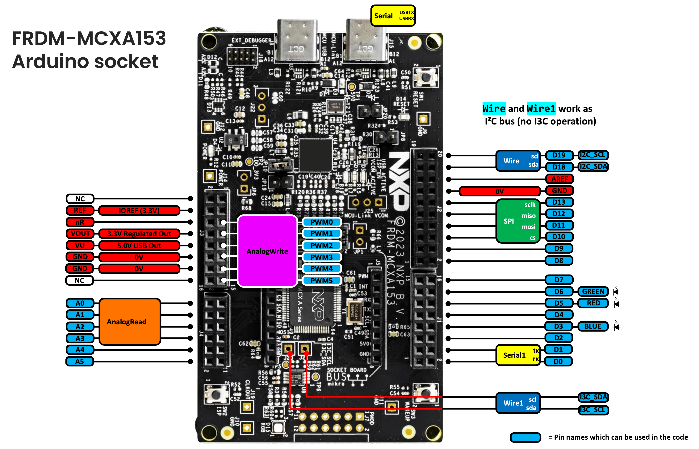

# Getting Started with mcx-arduino-core

A hands-on walkthrough of the Arduino API on the NXP FRDM-MCXA153 board, from
installation to every supported peripheral. Each section is a complete,
runnable sketch. See [README.md](README.md) for the full API reference table
and [CHANGELOG.md](CHANGELOG.md) for version history.

> **Note**: This tutorial's examples target the **FRDM-MCXA153** board.

日本語版はこちら → [TUTORIAL.ja.md](TUTORIAL.ja.md)

## Contents

- [1. Installation](#1-installation)
  - [1.1. What you need](#11-what-you-need)
  - [1.2. Get the Arduino IDE](#12-get-the-arduino-ide)
  - [1.3. Install NXP LinkServer](#13-install-nxp-linkserver)
  - [1.4. Which USB connector to use](#14-which-usb-connector-to-use)
  - [1.5. Install the board package](#15-install-the-board-package)
  - [1.6. A quick tour of the Arduino IDE toolbar](#16-a-quick-tour-of-the-arduino-ide-toolbar)
  - [1.7. Troubleshooting](#17-troubleshooting)
- [2. Try It Out](#2-try-it-out)
  - [2.1. Your first sketch: blink the on-board LED](#21-your-first-sketch-blink-the-on-board-led)
  - [2.2. Serial output](#22-serial-output)
  - [2.3. Strings](#23-strings)
  - [2.4. Digital input and interrupts](#24-digital-input-and-interrupts)
  - [2.5. Analog input: `analogRead`](#25-analog-input-analogread)
  - [2.6. PWM output: `analogWrite`](#26-pwm-output-analogwrite)
  - [2.7. Timing: `millis` / `micros`](#27-timing-millis--micros)
  - [2.8. Sound: `tone` / `noTone`](#28-sound-tone--notone)
  - [2.9. I2C: `Wire` and the on-board sensor (`Wire1`)](#29-i2c-wire-and-the-on-board-sensor-wire1)
  - [2.10. SPI](#210-spi)
  - [2.11. A second serial port: `Serial1`](#211-a-second-serial-port-serial1)
  - [2.12. Bit-banged helpers: `shiftOut` / `shiftIn` / `pulseIn`](#212-bit-banged-helpers-shiftout--shiftin--pulsein)
  - [2.13. UNO R3/R4 compatibility](#213-uno-r3r4-compatibility)
- [Where to go next](#where-to-go-next)

## 1. Installation

### 1.1. What you need

- A **macOS, Windows, or Linux** computer
- An [FRDM-MCXA153](https://www.nxp.com/design/design-center/development-boards-and-designs/FRDM-MCXA153) board
- Arduino IDE 2.x
- NXP LinkServer
- A USB-C **data** cable — not a charge-only one. Many cheap USB-C cables
  only carry power and no data lines; if the board never shows up under
  **Tools → Port**, this is the first thing to try swapping

No external components are required for most of this tutorial — the board
has on-board LEDs, buttons, and a temperature sensor.

### 1.2. Get the Arduino IDE

Download the installer for your OS from
**[arduino.cc/en/software](https://www.arduino.cc/en/software)** and install
it. Any recent Arduino IDE **2.x** works (this guide doesn't cover the
legacy 1.8.x IDE).

### 1.3. Install NXP LinkServer

This board is programmed with **NXP LinkServer**, not Arduino's own upload
tool, so it needs to be installed separately *before* you upload anything.

👉 Download: [nxp.com/linkserver](https://www.nxp.com/linkserver)

| OS | Installer |
|----|-----------|
| macOS | `.pkg` file, double-click to install |
| Windows | `.exe` installer |
| Linux | `.deb.bin` file |

This tutorial's full install → build → upload flow has been verified on
**macOS, Windows 11, and Linux**.

Once installed, the board package's upload script finds LinkServer
automatically — no path configuration needed.

### 1.4. Which USB connector to use

The board has **two** USB-C connectors — plugging into the wrong one means
nothing will show up in the IDE. Use the one silkscreened **"MCU-Link
USB"** (connector **J15**). That port is the on-board debug probe: it's what
LinkServer uploads through, it powers the board, and it's what `Serial`
(the USB-bridged serial port) comes out of.

Don't use the other connector, silkscreened **"MCU USB"** (**J8**) — that one
wires directly to the MCXA153's own USB peripheral, which this board
package doesn't use for anything in this tutorial.

### 1.5. Install the board package

1. Open Arduino IDE → **File → Preferences**
2. Add this URL under **Additional boards manager URLs**:
   ```
   https://raw.githubusercontent.com/teddokano/mcx-arduino-core/main/package_nxp_mcx_index.json
   ```
3. **Tools → Board → Boards Manager**, search `NXP MCX`, click **Install**
   — this also downloads the ARM GCC toolchain (a few hundred MB) the
   first time, which can take several minutes depending on your
   connection. Watch the progress bar at the bottom of the Boards Manager
   window; it isn't frozen, just downloading
4. **Tools → Board**, select **FRDM-MCXA153 (mcx-arduino-core)**
5. Plug the board into the **MCU-Link USB (J15)** connector and select its
   port under **Tools → Port**

Full details are in [README.md](README.md#installation).

### 1.6. A quick tour of the Arduino IDE toolbar

The toolbar at the top of the sketch window has a few icons you'll use
constantly:

| Icon | What it does |
|---|---|
| ✔ (checkmark) | **Verify** — compiles the sketch without uploading, useful to catch errors quickly |
| → (right arrow) | **Upload** — compiles *and* uploads to the board (via LinkServer, over the MCU-Link USB connector) |
| 🔍 (magnifying glass), top right | **Serial Monitor** — opens a panel showing whatever the sketch sends with `Serial.print`/`println` |

Compiler errors and the upload log show up in the black output pane at the
bottom of the window — if an upload fails, that's the first place to look.

Every sketch in this tutorial calls `Serial.begin(...)`, so after clicking
**Upload**, click the Serial Monitor icon and make sure its baud rate
(bottom-right of the Serial Monitor panel) matches the sketch's
`Serial.begin()` value (115200 in most examples here) — otherwise you'll see
garbled text or nothing at all.

### 1.7. Troubleshooting

**Nothing shows up under Tools → Port:**
- Try a different USB-C cable — make sure it's a data cable, not
  charge-only (see [1.1](#11-what-you-need))
- Make sure you're plugged into **MCU-Link USB (J15)**, not **MCU USB
  (J8)** (see [1.4](#14-which-usb-connector-to-use))
- Make sure NXP LinkServer is installed (see [1.3](#13-install-nxp-linkserver))
- Unplug and replug the board, or try a different USB port on your
  computer

**Upload fails, or the output pane shows a LinkServer error:**
- Confirm LinkServer is actually installed — the upload script looks for
  it automatically, but only finds it if it's installed
- On Windows, check **Device Manager** for a driver problem (a yellow
  warning icon) on the board's entry
- Close any other program that might be holding the port open (another
  Serial Monitor instance, a terminal program, etc.)

**Serial Monitor shows garbled text or nothing at all:**
- Check the baud rate matches the sketch's `Serial.begin()` value, as
  described above
- Make sure the sketch actually finished uploading (watch for "Done
  uploading" in the output pane) before expecting output

If none of this helps, the [README.md](README.md) has more detail, or open
an issue on the
[GitHub repo](https://github.com/teddokano/mcx-arduino-core/issues).

## 2. Try It Out

The pins used throughout this section, all in one picture:



### 2.1. Your first sketch: blink the on-board LED

The board has three on-board LEDs (`RED`, `GREEN`, `BLUE`) wired **active-low**
— `LOW` turns a LED on, `HIGH` turns it off. `LED_BUILTIN` is aliased to
`GREEN`.

```cpp
#include <Arduino.h>

void setup() {
  pinMode(LED_BUILTIN, OUTPUT);
}

void loop() {
  digitalWrite(LED_BUILTIN, LOW);   // on
  delay(500);
  digitalWrite(LED_BUILTIN, HIGH);  // off
  delay(500);
}
```

Click **Upload**. The green LED should blink once per second.

### 2.2. Serial output

`Serial` is the USB-bridged serial port. `while (!Serial);` in `setup()`
waits for the Serial Monitor to connect before printing, so you don't miss
the first lines.

```cpp
#include <Arduino.h>

void setup() {
  Serial.begin(115200);
  while (!Serial)
    ;

  Serial.println("Hello, world!");
}

void loop() {
}
```

Open **Tools → Serial Monitor** (115200 baud) after uploading.

`Serial` reads too: type a number into the Serial Monitor's input box and
press Enter, and `Serial.parseInt()` picks it out, same as classic Arduino:

```cpp
void loop() {
  if (Serial.available()) {
    int n = Serial.parseInt();
    Serial.print("got: ");
    Serial.println(n);
  }
}
```

### 2.3. Strings

`String` works the same way as on classic Arduino — build text out of
numbers and other strings with `+`, and pass the result straight to
`Serial.print()`/`println()`:

```cpp
#include <Arduino.h>

int count = 0;

void setup() {
  Serial.begin(115200);
  while (!Serial)
    ;
}

void loop() {
  String msg = "reading #" + String(count) + ": " + String(3.3 * count / 10.0, 2) + "V";
  Serial.println(msg);
  count++;
  delay(500);
}
```

`substring()`, `indexOf()`, `replace()`, `toUpperCase()`/`toLowerCase()`,
`toInt()`/`toFloat()`, and the rest of the usual `String` API are all
available — see
[`examples/Arduino_compatible_API/test_String`](examples/Arduino_compatible_API/test_String).

### 2.4. Digital input and interrupts

The board has two on-board buttons, `SW2` and `SW3`, wired active-low with
pull-ups needed (`INPUT_PULLUP`). This example toggles the blue LED on a
button press using `attachInterrupt` instead of polling:

```cpp
#include <Arduino.h>

volatile bool sw_pressed = false;
bool led_state = true;

void callback() {
  sw_pressed = true;
}

void setup() {
  Serial.begin(115200);

  pinMode(BLUE, OUTPUT);
  pinMode(SW2, INPUT_PULLUP);
  attachInterrupt(digitalPinToInterrupt(SW2), callback, FALLING);

  digitalWrite(BLUE, led_state);
}

void loop() {
  if (sw_pressed) {
    sw_pressed = false;
    led_state = !led_state;
    digitalWrite(BLUE, led_state);
    Serial.println("SW2 pressed");
    delay(100);  // debounce
  }
}
```

`INPUT_PULLDOWN` is also available, for wiring a button/switch the other
way around (pulled low by default, reads `HIGH` when pressed).

### 2.5. Analog input: `analogRead`

`analogRead` reads pins `A0`-`A3` through the on-chip LPADC and returns a
10-bit value (0-1023), same range as classic Arduino boards. (`A4`/`A5` exist
as pin names but aren't ADC-capable on this board — see the
[pin mapping table](README.md#pin-mapping-frdm-mcxa153).)

Connect a potentiometer (or any 0-3.3V analog signal) to `A0`, or just try it
unconnected to see floating-pin noise:

```cpp
#include <Arduino.h>

void setup() {
  Serial.begin(115200);
  while (!Serial)
    ;
}

void loop() {
  int value = analogRead(A0);
  Serial.print("A0 = ");
  Serial.println(value);
  delay(200);
}
```

### 2.6. PWM output: `analogWrite`

PWM is only available on the dedicated pins `PWM0`-`PWM5` (FlexPWM0), not on
every digital pin. The period is fixed at 1kHz; `analogWrite` only controls
duty cycle (0-255), same as classic Arduino. This example mirrors the ADC
reading from section 2.4 onto a PWM output — connect an LED (with a resistor) or
scope to `PWM0` to see it change:

```cpp
#include <Arduino.h>

void setup() {
  Serial.begin(115200);
}

void loop() {
  int value = analogRead(A0);
  analogWrite(PWM0, value >> 2);  // 10bit -> 8bit
  delay(200);
}
```

### 2.7. Timing: `millis` / `micros`

Standard Arduino timing functions, backed by SysTick (1ms tick) + the DWT
cycle counter. `millis()` doesn't roll over for about 49 days, just like a
classic Arduino.

```cpp
#include <Arduino.h>

void setup() {
  Serial.begin(115200);
  while (!Serial)
    ;
}

void loop() {
  Serial.print("millis = ");
  Serial.print(millis());
  Serial.print("  micros = ");
  Serial.println(micros());
  delay(500);
}
```

### 2.8. Sound: `tone` / `noTone`

`tone()` works on **any** digital pin (via CTIMER0 software-toggling the
pin), unlike `analogWrite` which is limited to `PWM0`-`PWM5`. Only one tone
can play at a time. Connect a piezo buzzer between `D13` and GND:

```cpp
#include <Arduino.h>

#define BUZZER_PIN D13

void setup() {
}

void loop() {
  tone(BUZZER_PIN, 440, 200);  // A4, 200ms
  delay(300);
  noTone(BUZZER_PIN);
  delay(700);
}
```

See [`examples/Arduino_compatible_API/test_tone`](examples/Arduino_compatible_API/test_tone)
for a full melody example.

### 2.9. I2C: `Wire` and the on-board sensor (`Wire1`)

The board has an on-board P3T1755 temperature sensor wired to the MCU's I3C
peripheral — but `Wire1` drives it in **I2C-compatibility mode**, so it's a
normal `TwoWire` object talking plain I2C (no I3C-specific features like
dynamic addressing or IBI are used). No wiring or extra library needed for
this one — talk to its register interface directly with the standard
`beginTransmission()` / `write()` / `endTransmission()` / `requestFrom()` /
`read()` calls, exactly as you would with any I2C device that doesn't have
a driver library:

```cpp
#include <Arduino.h>

const uint8_t SENSOR_ADDR = 0x48;
const uint8_t TEMP_REG = 0x00;

void setup() {
  Serial.begin(115200);
  while (!Serial)
    ;

  Wire1.begin();
}

void loop() {
  Wire1.beginTransmission(SENSOR_ADDR);
  Wire1.write(TEMP_REG);
  Wire1.endTransmission(false);  // repeated start, keep the bus held

  Wire1.requestFrom(SENSOR_ADDR, (size_t)2);
  uint8_t msb = Wire1.read();
  uint8_t lsb = Wire1.read();

  // P3T1755's temperature register: 2 bytes, MSB first, 11-bit two's
  // complement value left-justified in the 16-bit word (bits 15:5),
  // 0.125 degC per LSB at bit 5.
  int16_t raw = (int16_t)((msb << 8) | lsb) >> 5;
  Serial.println(raw * 0.125f, 4);

  delay(1000);
}
```

Full sketch:
[`examples/Arduino_compatible_API/test_Wire1_onboard_sensor_raw`](examples/Arduino_compatible_API/test_Wire1_onboard_sensor_raw).
(If you'd rather use a driver library instead of talking to the registers
directly, see
[`examples/Arduino_compatible_API/onboard_temperature_sensor`](examples/Arduino_compatible_API/onboard_temperature_sensor).)

For an *external* I2C device instead, use the regular `Wire` object
(`SDA`/`SCL` on `D18`/`D19`) the same way — exactly as on a classic
Arduino. See
[`examples/Arduino_compatible_API/test_Wire_LM75B`](examples/Arduino_compatible_API/test_Wire_LM75B)
for the same register-access technique against an external LM75-family
sensor.

### 2.10. SPI

Standard `SPISettings`-based API on pins `D10`(CS)/`D11`(MOSI)/`D12`(MISO)/`D13`(SCLK):

```cpp
#include <Arduino.h>

void setup() {
  Serial.begin(115200);
  SPI.begin();
  pinMode(SS, OUTPUT);
}

void loop() {
  uint8_t data[] = { 0x00, 0x01, 0x02, 0x03 };

  SPI.beginTransaction(SPISettings(1000000, MSBFIRST, SPI_MODE0));
  digitalWrite(SS, LOW);
  SPI.transfer(data, sizeof(data));
  digitalWrite(SS, HIGH);
  SPI.endTransaction();

  delay(1000);
}
```

This needs an actual SPI peripheral (or a loopback wire from MOSI to MISO)
to see any response — see
[`examples/Arduino_compatible_API/test_SPI_loopback_with_a_wire`](examples/Arduino_compatible_API/test_SPI_loopback_with_a_wire).

### 2.11. A second serial port: `Serial1`

`Serial` is bridged over USB. `Serial1` is a second, independent hardware
UART on pins `D0`(RX)/`D1`(TX), for talking to external serial devices
without tying up the USB connection:

```cpp
#include <Arduino.h>

void setup() {
  Serial1.begin(9600);
}

void loop() {
  Serial1.println("hello from Serial1");
  delay(1000);
}
```

To test it stand-alone with no other hardware, jumper `D1` to `D0` and read
back what you sent — see
[`examples/Arduino_compatible_API/test_Serial1`](examples/Arduino_compatible_API/test_Serial1).

### 2.12. Bit-banged helpers: `shiftOut` / `shiftIn` / `pulseIn`

Same signatures as classic Arduino, implemented in software on top of
`digitalWrite`/`digitalRead`/`micros()`:

```cpp
shiftOut(dataPin, clockPin, MSBFIRST, myByte);
uint8_t b = shiftIn(dataPin, clockPin, MSBFIRST);
unsigned long width = pulseIn(pin, HIGH);
```

`random()` / `randomSeed()` are also available, matching the classic Arduino
signatures. See
[`examples/Arduino_compatible_API/test_shiftOut_pulseIn_random`](examples/Arduino_compatible_API/test_shiftOut_pulseIn_random).

### 2.13. UNO R3/R4 compatibility

Sketches written for an Arduino UNO that use these will compile as-is, no
extra `#include`s needed: `PI`, `HALF_PI`, `TWO_PI`, `DEG_TO_RAD`,
`RAD_TO_DEG`, `radians()`, `degrees()`, `min()`/`max()`, `abs()`,
`constrain()`, `sq()`, `map()`, `lowByte()`/`highByte()`, `bitRead()` /
`bitSet()` / `bitClear()` / `bitToggle()` / `bitWrite()` / `bit()`,
`interrupts()` / `noInterrupts()`, `boolean`/`byte`/`word`, `LSBFIRST`/`MSBFIRST`.

## Where to go next

- [README.md](README.md) — full API support table and pin mapping
- [`examples/Arduino_compatible_API/`](examples/Arduino_compatible_API) — one focused sketch per feature
- [`examples/Arduino_compatible_API/test_combined_peripherals`](examples/Arduino_compatible_API/test_combined_peripherals) — everything running at once
- [CHANGELOG.md](CHANGELOG.md) — what changed between versions
- Advanced guides, past the standard Arduino API:
  [calling the MCUXpresso SDK directly](docs/advanced_sdk_tuning.md),
  [native I3C via r01lib](docs/advanced_r01lib_i3c.md), and
  [debugging pin ownership with mcxPinState](docs/mcxpinstate_guide.md)
