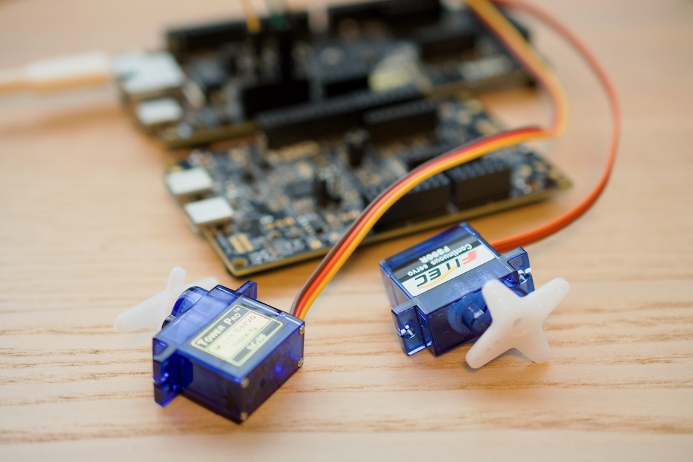
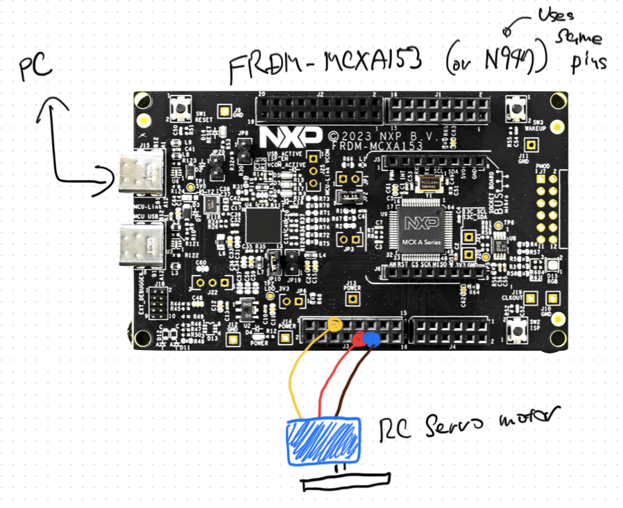

# mcxRCServo

English | [日本語](README.ja.md)

**RC servo motor** library for [mcx-arduino-core](https://github.com/teddokano/mcx-arduino-core).



Drives a hobby RC servo from a PWM pin. Two servos come ready to use:
**SG90** (positional rotation) and **FS90R** (continuous rotation), each
carrying the pulse timing from its own datasheet.

Every example has been run on both FRDM-MCXA153 and FRDM-MCXN947.

## Usage

```cpp
#include <SG90.h>

SG90 servo(PWM0);

void setup() {
  servo.range(-90, 90);   //  work in degrees
}

void loop() {
  servo.position(90);
  delay(500);
  servo.position(-90);
  delay(500);
}
```

```cpp
#include <FS90R.h>

FS90R servo(PWM0);

void loop() {
  servo.speed(1.0);   //  CCW, full speed
  delay(2000);
  servo.stop();
  delay(2000);
}
```

Three examples:

- `SG90_basic` -- the shortest thing that moves a servo
- `SG90_moves` -- a positional servo run through steps, a constant speed
  glide, an eased glide, a decaying wobble and random flicks
- `FS90R_rotate` -- a rotation servo at full speed both ways, then ramped
  across its whole speed range

The servo has one speed of its own, so anything slower or shaped comes from
the sketch feeding it a stream of intermediate values on a timer rather than
one final value. `SG90_moves` does that with a small `glide()` helper.

## Class hierarchy

```
mcxRCServo          PWM output and the value-to-pulse-width mapping
 |
 +- PositionServo    the pulse width is a shaft angle: position()
 |   +- SG90         0.50-2.40ms, 50Hz
 |
 +- RotationServo    the pulse width is a rotation speed: speed(), stop()
     +- FS90R        0.70-2.30ms, 50Hz
```

`mcxRCServo` knows nothing about what the value it is given means -- it only
maps a user value range onto a pulse width range. The two classes below it
give that value a meaning, and the product classes below *those* supply the
pulse timing of one actual servo.

### range()

`range(left, right)` sets the unit the application wants to work in. It maps
onto the servo's pulse width range: `left` to the shortest pulse, `right` to
the longest. Degrees for a positional servo, percent or RPM for a rotation
one, anything else that suits the sketch. Values handed to `position()` /
`speed()` are constrained to that range.

The default is 0.0 to 1.0, except for `RotationServo`, which sets -1.0 to
+1.0 so that the stop pulse sits at zero.

## Adding another servo

Derive from `PositionServo` or `RotationServo` and hand the pulse timing to
its constructor. That is all a product class does:

```cpp
class MG996R : public PositionServo
{
public:
  MG996R(int pwm_pin);

private:
  static constexpr double frequency_hz = 50.00;
  static constexpr double pulse_high_min_ms = 0.50;
  static constexpr double pulse_high_max_ms = 2.50;
};

MG996R::MG996R(int pwm_pin)
  : PositionServo(pwm_pin, pulse_high_min_ms, pulse_high_max_ms, frequency_hz) {}
```

A servo whose pulse timing is not known can be driven through
`PositionServo` / `RotationServo` directly, giving the timing to the
constructor.

## Why mcx-arduino-core only

`library.properties` says `architectures=mcx`. That is not caution -- this
library leans on two things a stock Arduino core does not have.

**`mcxRCServo` derives from `Obj`.** `Obj` is r01lib's common base for every
peripheral driver in mcx-arduino-core, and its one job is to run the chip's
`init_mcu()` exactly once, on the first peripheral object anybody constructs.
That is what this library needs, because a servo is normally a global object
and its constructor sets the pin's PWM frequency and resolution right there
-- which happens before `setup()`, before `main()`. On a stock core nothing
has brought the hardware up that early. Deriving from `Obj` is what makes
touching the PWM peripheral from a global constructor safe.

**`analogWriteFrequency()` is not the official Arduino API.** An RC servo
needs its pulses repeated at about 50Hz, and plain `analogWrite()` offers no
way to ask for a frame rate. `analogWriteFrequency( pin, hz )` is a de facto
extension that some vendor cores provide -- Teensy's is the best known one --
because official Arduino never standardized PWM frequency control, AVR's
timers being unable to do it cleanly. mcx-arduino-core provides it; most
cores do not.

Porting to another core means replacing both: drop the `Obj` base and move
the PWM setup out of the constructor into a `begin()` the sketch calls from
`setup()`, then supply whatever that core offers for setting a PWM frequency.
Everything above `mcxRCServo` -- the per-servo pulse timing, the value range
mapping, the class hierarchy -- is plain arithmetic and would carry over
untouched.

## Hardware notes



Three wires, in the usual RC servo colours: brown to ground, red to the
supply, orange or yellow to the signal pin.

The signal line goes to any of the `PWM0`-`PWM5` pins -- the ones
`analogWrite()` can drive, labelled on the board silkscreen. Both boards put
them in the same place on the headers, so the same wiring and the same sketch
work on either; what differs is only the MCU pin behind the name.

| Pin name | FRDM-MCXA153 | FRDM-MCXN947 |
|---|---|---|
| `PWM0` | P3_11 | P2_3 |
| `PWM1` | P3_10 | P2_2 |
| `PWM2` | P3_9  | P2_5 |
| `PWM3` | P3_8  | P2_4 |
| `PWM4` | P3_7  | P2_7 |
| `PWM5` | P3_6  | P2_6 |

`PWM0`-`PWM5` pair up two to a FlexPWM submodule -- `PWM0`/`PWM1`,
`PWM2`/`PWM3`, `PWM4`/`PWM5` -- and each pair shares one period register, so
setting one pin's frequency sets its partner's as well. Every servo here
wants 50Hz, so a pair of them is fine; a servo sharing a pair with something
that wants a different PWM frequency is not.

The SG90 examples were verified with the servo powered from the board, wired
as drawn above. A positional servo only draws current while it is actually
moving, and an unloaded SG90 moving in short bursts stays inside what the
board can give.

**The FS90R needs its own supply.** Running it from the board's 5V on an
FRDM-MCXA153 pulled the rail down far enough to make the USB link to the PC
unstable. A continuous rotation servo draws its running current for as long
as it is asked to turn, with a surge at every direction reversal, so it
leans on the supply in a way a positional servo never does. Give it 4.8V-6V
of its own with the grounds tied together, and do not assume another board
has more headroom.

The same goes for an SG90 once it has a load to move, or a second servo
joins it. An FS90R stalls at 650mA and an SG90 at several hundred
milliamps, past what USB feeds the board's 5V rail -- and the dips reach the
board's own supply well before stall.

Neither datasheet states an input threshold for the signal line. Both servos
take the board's 3.3V logic level while running from a 5V supply, which is
how the examples were verified on both boards.

## Notes

Both servos are analog types and their datasheets give no frame rate; the
50Hz used here is the usual one for an analog RC servo.

`analogWriteResolution()` is a global setting in the Arduino API, so the
resolution given to the last constructed servo applies to every
`analogWrite()` in the sketch. The default of 16 bits is left alone unless
there is a reason to change it.

## License

MIT
